# FDE 全栈学习中心与交付模拟舱 (FDE Hub & Flight Simulator)
## 产品需求文档 (PRD) 与知识架构蓝图

> **文档版本**：v1.0.0 (审核版)  
> **文档定位**：全方位、深层次覆盖前线部署工程师（Forward Deployed Engineer）的资料体系、认知模型、交付方法论、原生工程手艺与沙盒实战。拒绝走马观花，打造能够支撑工程师完成从“玩具 Demo”向“企业级高价值生产交付”蜕变的实战训练平台。

---

## 一、 产品定位与解决的核心痛点

### 1.1 目标用户画像
1. **转型中的 AI / 软件工程师 (SWE)**：掌握模型 API 与 Prompt 技巧，但在面对企业脏乱数据、复杂内网隔离与业务政治时束手无策。
2. **AI 原生创业团队创始人 / CTO**：正在开拓企业级客户，急需建立标准化的 PoC 转化机制与交付护城河，摆脱低毛利外包陷阱。
3. **企业解决方案架构师 (SA) / 技术售前**：希望掌握“48 小时拿出生产级可用原型并算清账本”的高确定性商业破冰能力。

### 1.2 解决的行业核心痛点
* **MIT 95% 阵亡率破局**：麻省理工 NANDA 实验室揭示 95% 的 GenAI PoC 无法进入生产并产生财务价值。本平台以 **“交付确定性”** 为唯一导向，系统传授如何抹平“通用模型”与“企业现实”之间的 **The Delta**。
* **终结纸上谈兵与框架依赖**：摒弃市面上泛滥的“5 分钟搭建智能客服”等浅层玩具教程，深入单向光闸（Air-gap）、Schema 刚性约束、生产级原生 Agent 循环以及 SOW 契约防御。

---

## 二、 资料图谱全景分层架构 (Information Taxonomy)

本平台不是资料的简单搬运，而是将全网散落的一手内参、开源著作、底层代码与商业契约进行**四层结构化纳管**：

```
┌────────────────────────────────────────────────────────────────────────┐
│ 第 1 层：根源哲学与一手内参 (Foundations & Genes)                       │
│ • Palantir S-1 招股书与 Foundry 架构哲学 (The Delta & Productized Consulting) │
│ • MIT NANDA 实验室《The GenAI Divide》(2025 企业落地死亡峡谷报告)        │
│ • Anthropic MCP (Model Context Protocol) 官方协议与 JSON-RPC 规范      │
│ • OpenAI Applied AI 生产级 Function Calling & Evals 实践指引            │
├────────────────────────────────────────────────────────────────────────┤
│ 第 2 层：本土化全景专著与体系地图 (Systematic Delivery Playbook)          │
│ • 范冰《前线部署工程师：人工智能时代的客户价值交付秘籍》全 8 章深度沉淀  │
│ • 附录 A 完整指标库（4 大维度指标、24+ 行业黑话深度辨析）              │
│ • Pier Paolo Ippolito《Awesome-FDE-Roadmap》(VPC-SC, Air-Gap, Modern Data Stack) │
├────────────────────────────────────────────────────────────────────────┤
│ 第 3 层：原生工程手艺与硬核代码库 (No-Framework Engineering Weaponry)  │
│ • calmrocks《ai-engineer-notebooks》(纯 Python 免框架 Agent 循环、熔断器)│
│ • Pydantic 强类型约束解码与防御性 Schema 守门员                         │
│ • RAGAS 评测四维体系 (Faithfulness, Relevance, Precision, Recall) 数学定义与代码 │
│ • 绝密单向光闸与离线容器构建规程 (Zero-Telemetry DLP 脱敏)            │
├────────────────────────────────────────────────────────────────────────┤
│ 第 4 层：商业护城河与交付防具 (Commercial Defenses & Contracts)        │
│ • SOW (Statement of Work) 防御性工程模板（锁定范围，抗击 Scope Creep） │
│ • UAT 黄金测试集（Golden Test Set）构建标准与客方签字准则               │
│ • Cost of Inaction (CoI) 财务推演测算模型与高管谈判话术库              │
└────────────────────────────────────────────────────────────────────────┘
```

---

## 三、 学习方法论与训练引擎设计 (Learning Skills)

平台严格围绕 **四大认知与实战方法论** 构建学习体验：

| 学习技能 / 方法论 | 平台对应的功能落地 | 解决的认知陷阱 |
| :--- | :--- | :--- |
| **1. 启发式逆向工程<br>(Pre-Mortem Inversion)** | **“事前验尸”决策沙盘**：在立项前预演 10 种暴毙场景（接口漂移、无内部冠军、数据污染等），倒推技术选型与防护边界。 | 杜绝盲目崇拜技术，先看死穴在哪里。 |
| **2. 项目式沙盒淬炼<br>(Project-Based Learning)** | **恶劣现场挑战任务卡**：设计 3 个高难度极限挑战（金融报表合规审查、工业离线故障诊断、客户无理加需求谈判），限时 48 小时攻防。 | 告别干净的玩具数据，在脏乱差真实环境练兵。 |
| **3. 原子手艺肌肉记忆<br>(Deliberate Kata)** | **30 分钟无框架代码练兵场**：提供无黑盒框架的原生代码模板、错误注入用例与手写验收规范。 | 根除“离开 LangChain 不会写 Agent”的技术软骨病。 |
| **4. 双轨双语翻译能力<br>(Dual-Track Translation)** | **商业-技术双面看板**：任何技术重构（如调整 Reranker）均配有对应的 CXO 财务指标折算与价值说服话术。 | 治好“只会跟客户汇报技术参数”的沟通低能症。 |

---

## 四、 平台功能模块蓝图 (Feature Matrix)

```mermaid
graph TD
    App["FDE 全栈学习中心 & 交付模拟舱"]
    App --> Mod0["模块〇：心智重塑与岗位本质"]
    App --> Mod1["模块一：六大交付战役 (Playbook)"]
    App --> Mod2["模块二：无框架硬核工程手艺 (Code)"]
    App --> Mod3["模块三：恶劣现场沙盒挑战 (PBL)"]
    App --> Mod4["模块四：交互式现场工具箱 (Tools)"]
    App --> Mod5["模块五：实战决策与面试考场 (Quiz)"]
    App --> Mod6["模块六：个人成长看板与进度跟踪"]

    Mod0 --> M0_1["MIT 95% 报告深度解剖"]
    Mod0 --> M0_2["Palantir 'The Delta' 哲学"]
    Mod0 --> M0_3["五大角色对比矩阵 (FDE vs SWE vs SA...)"]

    Mod1 --> M1_1["战役1: 解决正确问题与 PoC 坟墓"]
    Mod1 --> M1_2["战役2: 赢得客户与警惕需求蝗虫"]
    Mod1 --> M1_3["战役3: 激活部署与首日魔咒"]
    Mod1 --> M1_4["战役4: 守住续约与有损服务"]
    Mod1 --> M1_5["战役5: 按结果收费与存量深耕"]
    Mod1 --> M1_6["战役6: 规模化复制与 Playbook 沉淀"]

    Mod2 --> M2_1["原生 ReAct 循环与状态机熔断"]
    Mod2 --> M2_2["Pydantic 刚性结构化约束输出"]
    Mod2 --> M2_3["Anthropic MCP 协议标准实装"]
    Mod2 --> M2_4["Air-Gap 隔离网与零遥测 (DLP)"]
    Mod2 --> M2_5["RAGAS 评测自动化流水线"]

    Mod4 --> T1["Cost of Inaction 商业损失测算器"]
    Mod4 --> T2["SOW 需求边界防御自检表"]
    Mod4 --> T3["Air-Gap 离线部署排雷清单"]
    Mod4 --> T4["24+ 交付现场核心黑话速查词典"]
```



### 4.1 核心交互功能细节
1. **深阅读与全景检索体验**：
   - 树状目录导航，支持各级标题平滑滚动与锚点定位。
   - 瞬时全文过滤检索：支持模糊匹配标题、关键词与代码片段。
2. **学习打卡与状态持久化 (LocalStorage)**：
   - 每个知识单元均有专属“完成打卡”状态。
   - 顶部实时显示全局进度条（如 `已完成 8/18 单元 44%`），数据完全本地持久化，跨会话不丢失。
3. **现场交互式计算器 (CoI Calculator)**：
   - 输入业务人数、平均薪资、重复耗时比、历史错误罚款，实时生成月度/年度损失推演，并输出面向 CXO 的精准说服话术。
4. **交付双防线自检表 (Checklist Validators)**：
   - SOW 防需求蔓延检查表（4 大关键契约红线）。
   - Air-Gap 离线排雷自检表（4 大内网安全合规红线）。
5. **高保真情境模拟自测 (Interactive Quiz Deck)**：
   - 10 道覆盖客户争端、系统崩溃、单点依赖、离线合规等高频现场场景的单选/多选题。
   - 选项点击即时判定（红/绿高亮），并展开**资深 FDE 的现场决策复盘解析**。

---

## 五、 技术架构与部署方案 (Cloudflare Pages)

### 5.1 架构设计原则（严格遵循 Ponytail 极简主义）
* **零多余抽象与黑盒**：无需安装几十兆的 Webpack / Vite / Next.js 框架依赖。
* **原生轻量级三件套**：HTML5 + 现代原生 CSS Variables + ES6 模块化 Vanilla JS。
* **极致性能指标**：首屏渲染时间 < 150ms，全球 CDN 静态分发，100/100 移动端适配。
* **隐私与离线安全**：无任何第三方 Cookie、无追踪上报代码，完全支持本地离线环境保存阅读。

### 5.2 Cloudflare 部署配置规范
* **归属目录**：`/Users/rock/Projects/haossll666/fde-learning-hub/`（符合本地环境 Git 账号映射准则）。
* **认证账号**：`xxlupward@gmail.com`（Account ID: `ffb134a45cfc3c1c1c3da047900e2cf7`）。
* **自动化部署命令**：`wrangler pages deploy . --project-name fde-learning-hub`。
* **产出公网资产**：获得官方在全球部署的免费 SSL 证书及 `https://fde-learning-hub.pages.dev` 访问节点。

---

## 六、 待用户审核确认的决策清单 (Checklist for Review)

- [ ] **内容深度与广度**：目前的 4 层资料图谱是否完全覆盖了您的预期？是否有特定垂直行业（如医疗、跨境电商）需额外重点加码？
- [ ] **学习模式权重**：是否满意“先读战役方法论 ➔ 再练原生工程代码 ➔ 接着做沙盒挑战 ➔ 最后用工具箱与题库自检”的学习流线？
- [ ] **产品交互形式**：单页应用（SPA）包含“左侧树状目录导航 + 右侧沉浸式内容/工具切换”是否符合您的长期学习习惯？
